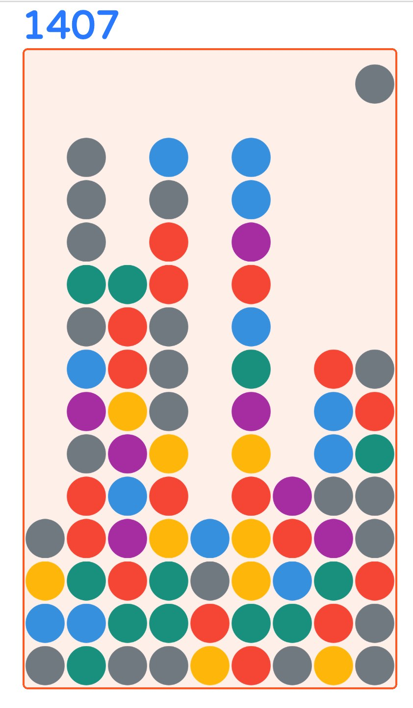

# Popdris
[Popdris](https://phaze1d.github.io/Popdris/) is a HTML canvas game that run on [PixiJS](http://www.pixijs.com/) game engine. It is a mix between Candy Crush and Tetris. The user swipes on a bubble to move it up down left or right and has to combine 3 or more bubbles of the same color to be able to pop them. The more bubbles the user combines the more points they get. The game is a single infinite level game that only ends once a bubble reaches the top of the game area. **The game starts of very easily but will become harder and harder the longer you last**

<p align="center">

</p>

## Getting Started
Do to Cross Origin Requests you have to run a local http server to serve the files. If you have python installed you can just run these commands inside the directory
```
$ python -m SimpleHTTPServer 8000
```
and open the game at `localhost:8000`. Or if you have nodejs you can run
```
$ npm install http-server -g
$ http-server ./
```
and open the game at `localhost:8080`.


## Pop Algorithm
This is the algorithm that I use when the user clicks on a bubble. It is a recursive algorithm that checks if a bubble is not moving and if it is of the same color and hasn't been checked it adds it to a remove list. If the remove list length is greater than three, then it removes all the bubbles in the list. This algorithm resembles a Breath First Search algorithm, but instead, it is not searching for a particular node just traversing the graph.

```javascript
GamePlay.prototype.popAlgorithm = function (column, row, color, popData) {
  var bub = this.getBubble(column, row);
  if(bub && bub.color === color && !bub.falling && !bub.switching && !bub.checked){
    bub.checked = true;
    popData.toRemove.push(bub);

    if(!popData.columns[column]) popData.columns[column] = {startAt: row};
    if(popData.columns[column].startAt > row) popData.columns[column].startAt = row;

    this.popAlgorithm(column, row + 1, color, popData); // Check up
    this.popAlgorithm(column, row - 1, color, popData); // Check down
    this.popAlgorithm(column - 1, row, color, popData); // Check left
    this.popAlgorithm(column + 1, row, color, popData); // Check right
  }
}
```

## Instructions
- Objective is not to hit the top border and get as many points as possible
- Move a bubble by pressing and moving the mouse either up down left or right. You can only move one step at a time, and you can only move to nonempty spaces.
- Pop bubbles by tapping on a group of 3 or more bubbles of the same color

## Built With
- [PixiJS](http://www.pixijs.com/) Javascript Game Engine
- [SpinKit](http://tobiasahlin.com/spinkit/) The cool little spinner at the start

## License
This project is licensed under the MIT License - see the [LICENSE.md](./LICENSE.md) file for details
